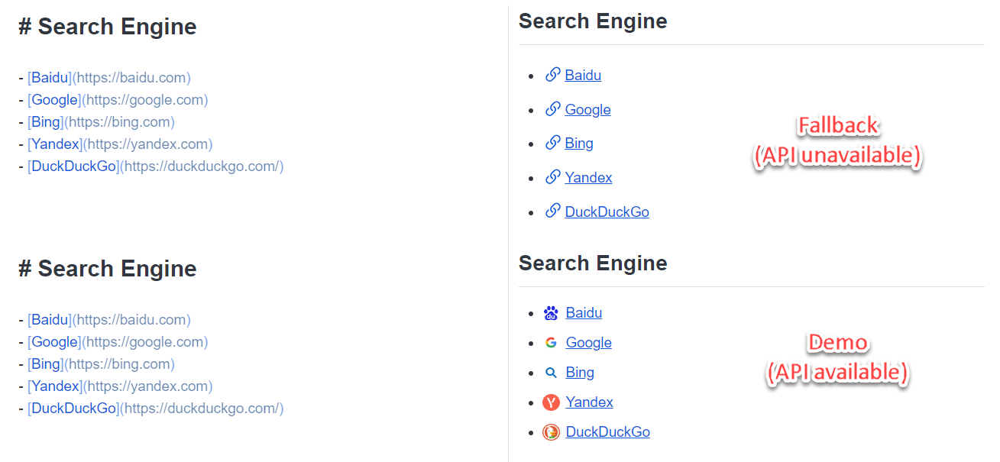

# Joplin Note Link Icon

   

This is a Joplin plugin to display icons for links in your notes.

## Features

- Automatically detect the links in current note, retrieve the corresponding icons through favicon providers' API (currently only support Google), and display them in the preview area.
- Fallback to the default icon when the favicon provider's API is unavailable.

## Roadmap

- Additional favicon provider support (such as DuckDuckGo, Icon Horse, FAVICONE, Favicon Kit, etc.).

## Acknowledgements

This plugin is mainly inspired by the following project:

- **[joplin-plugin-note-link-system](https://github.com/ylc395/joplin-plugin-note-link-system)** by [**ylc395**](https://github.com/ylc395)  
  *A complete Link System for Joplin.*

Thank you for your valuable contributions to the open source community!

## License
[MIT License](LICENSE.md) © jl.jiang (jjl9807)
